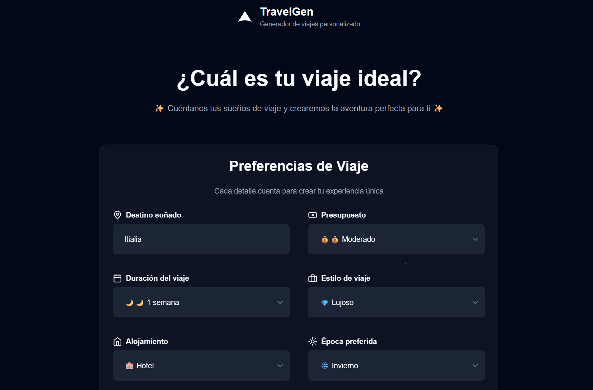

# 🌍 Travel Web - Generador de Itinerarios con IA

<div align="center">

Una aplicación web moderna construida con **Astro 5.x** y **Gemini AI** que genera itinerarios de viaje completos y personalizados en segundos.

[](https://astro.build/)
[](https://www.typescriptlang.org/)
[](https://tailwindcss.com/)
[](https://vercel.com/)

[](LICENSE)
[](CONTRIBUTING.md)
[](https://github.com/devlitus/travel-web/stargazers)

### 📸 Preview


*Generador de itinerarios con IA - Formulario de preferencias*

</div>

---

## 📑 Tabla de Contenido

- [✨ Características](#-características-principales)
- [📚 Documentación](#-documentación)
- [🛠️ Stack Tecnológico](#️-stack-tecnológico)
- [🚀 Inicio Rápido](#-inicio-rápido)
- [🎯 Cómo Funciona](#-cómo-funciona)
- [🏗️ Estructura del Proyecto](#️-estructura-del-proyecto)
- [🚢 Deployment](#-deployment-en-vercel)
- [🗺️ Roadmap](#️-roadmap)
- [🤝 Contribuciones](#-contribuciones)
- [📞 Soporte](#-soporte-y-contacto)

---

## ✨ Características Principales

- 🤖 **Generación con IA** - Itinerarios únicos creados por Gemini AI 2.0 Flash
- ⚡ **Ultra rápido** - Resultados en menos de 5 segundos
- 🎯 **Personalización total** - 7 parámetros + actividades seleccionables
- � **Responsive** - Perfectamente adaptado a todos los dispositivos
- 💾 **Sistema de caché** - Respuestas optimizadas y reutilizadas
- 🖼️ **Imágenes de calidad** - Integración con Unsplash API
- 🚫 **Sin registro** - Experiencia sin fricción

## 📚 Documentación

### Para Desarrolladores

- 📋 **[Business Rules](./.github/business-rules.md)** - Especificaciones técnicas completas
  - Validaciones y schemas (Zod)
  - Sistema de cache detallado
  - Configuración de APIs
  - Reglas de performance
  - Checklist de implementación

- 💻 **[Copilot Instructions](./.github/copilot-instructions.md)** - Guía de desarrollo
  - Convenciones de código
  - Estructura de componentes Astro
  - Mejores prácticas
  - Patrones del proyecto

- � **[Cache System](./CACHE_SYSTEM.md)** - Sistema de cache en detalle
  - Implementación de MemoryCache
  - Estrategias de invalidación
  - Uso y ejemplos

### Para Producto y Negocio

- 📋 **[Project Briefing](./.github/project-briefing.md)** - Visión y estrategia
  - Objetivo y propuesta de valor
  - Público objetivo
  - Roadmap de producto (v1.0 → v3.5)
  - Diferenciadores competitivos
  - Definición de éxito

### Instrucciones Específicas

- 🎨 **[Astro Best Practices](./.github/instructions/astro-best-practices.instructions.md)**
- 🎨 **[Tailwind Best Practices](./.github/instructions/tailwind-best-practices.instructions.md)**

## 🛠️ Stack Tecnológico

| Categoría      | Tecnología                               | Versión              |
| -------------- | ---------------------------------------- | -------------------- |
| **Framework**  | [Astro](https://astro.build/)            | 5.14.4               |
| **Lenguaje**   | TypeScript                               | 5.9.2                |
| **Estilos**    | [Tailwind CSS](https://tailwindcss.com/) | 4.1.11               |
| **IA**         | Google Gemini AI                         | 2.0 Flash            |
| **Validación** | Zod                                      | (via @astrojs/check) |
| **Deployment** | [Vercel](https://vercel.com/)            | SSG + API Routes     |
| **Imágenes**   | Unsplash API                             | -                    |

## 🏗️ Estructura del Proyecto

```text
travel-web/
├── .github/
│   ├── instructions/           # Instrucciones específicas por tipo
│   ├── business-rules.md       # Especificaciones técnicas
│   ├── project-briefing.md     # Visión y estrategia
│   └── copilot-instructions.md # Guía de desarrollo
├── public/
│   └── favicon.svg
├── src/
│   ├── assets/
│   │   └── images/             # Imágenes estáticas
│   ├── components/
│   │   ├── Header/             # Componente de cabecera
│   │   └── TravelForm/         # Formulario principal
│   │       ├── TravelForm.astro
│   │       ├── FormField.astro
│   │       ├── ActivitiesSection.astro
│   │       ├── ActivityButton.astro
│   │       ├── formHandler.ts
│   │       └── searchHandler.ts
│   ├── layouts/
│   │   └── Layout.astro        # Layout base
│   ├── pages/
│   │   ├── index.astro         # Página principal
│   │   ├── api/
│   │   │   ├── search.ts       # Endpoint de búsqueda con IA
│   │   │   └── unsplash-image.ts
│   │   └── itinerary/
│   │       └── [destination].astro  # Página dinámica de itinerarios
│   ├── styles/
│   │   ├── global.css          # Estilos globales
│   │   └── itinerary.css       # Estilos específicos
│   └── utils/
│       ├── cache.ts            # Sistema de cache
│       ├── cacheManager.ts
│       ├── clientCache.ts
│       ├── systemInstructions.ts
│       ├── transformMarkdownToJson.ts
│       └── unsplashService.ts
├── astro.config.mjs            # Configuración de Astro
├── tailwind.config.js          # Configuración de Tailwind
├── tsconfig.json               # Configuración de TypeScript
├── vercel.json                 # Configuración de Vercel
├── CACHE_SYSTEM.md             # Documentación del cache
└── package.json
```

## 🚀 Inicio Rápido

### Prerrequisitos

- Node.js 20+
- npm o pnpm
- API Keys (ver configuración)

### Instalación

1. **Clona el repositorio**

   ```bash
   git clone https://github.com/devlitus/travel-web.git
   cd travel-web
   ```

2. **Instala las dependencias**

   ```bash
   npm install
   ```

3. **Configura las variables de entorno**

   Crea un archivo `.env` en la raíz del proyecto:

   ```env
   # Requerido
   GEMINI_API_KEY=tu_api_key_de_gemini

   # Opcional (para imágenes)
   UNSPLASH_ACCESS_KEY=tu_access_key_de_unsplash
   ```

   > 📝 **Cómo obtener las API Keys:**
   >
   > - **Gemini AI**: [https://ai.google.dev/](https://ai.google.dev/)
   > - **Unsplash**: [https://unsplash.com/developers](https://unsplash.com/developers)

4. **Inicia el servidor de desarrollo**

   ```bash
   npm run dev
   ```

5. **Abre tu navegador** en `http://localhost:4321`

### Comandos Disponibles

| Comando           | Acción                                               |
| :---------------- | :--------------------------------------------------- |
| `npm install`     | Instala las dependencias                             |
| `npm run dev`     | Inicia el servidor de desarrollo en `localhost:4321` |
| `npm run build`   | Construye el sitio para producción en `./dist/`      |
| `npm run preview` | Previsualiza la build localmente                     |
| `npm run astro`   | Ejecuta comandos CLI de Astro                        |

## 🎯 Cómo Funciona

### Flujo de Usuario

```
1. Usuario completa formulario con preferencias
   ├── Destino (texto libre)
   ├── Presupuesto (económico/moderado/premium)
   ├── Duración (fin de semana a 1 mes)
   ├── Estilo de viaje (mochilero/lujo/familiar/aventura)
   ├── Alojamiento (hotel/hostal/apartamento/resort)
   ├── Temporada (verano/invierno/primavera/otoño)
   └── Actividades (múltiple selección)

2. Sistema envía preferencias a Gemini AI

3. IA genera itinerario completo (2-5 segundos)
   ├── Descripción del destino
   ├── Plan día por día
   ├── Actividades con horarios
   ├── Ubicaciones específicas
   ├── Costos estimados
   └── Tips y recomendaciones

4. Usuario visualiza itinerario personalizado
   └── Con imagen del destino (Unsplash)
```

### Características Técnicas Clave

- **Cache inteligente**: Las respuestas se cachean durante 1 hora (TTL configurable)
- **Validación robusta**: Todos los inputs validados con Zod schemas
- **SSG optimizado**: Páginas pre-renderizadas para máxima velocidad
- **API Routes**: Endpoints serverless en Vercel
- **Type-safe**: TypeScript en todo el proyecto

## � Deployment en Vercel

### Deployment Automático

1. **Conecta tu repositorio** a Vercel
2. **Configura las variables de entorno** en el dashboard:
   ```
   GEMINI_API_KEY=tu_api_key
   UNSPLASH_ACCESS_KEY=tu_access_key (opcional)
   ```
3. **Deploy automático** en cada push a `main` o `develop`

### Variables de Entorno en Vercel

Ve a: `Project Settings → Environment Variables`

| Variable              | Tipo   | Requerido   | Descripción                 |
| --------------------- | ------ | ----------- | --------------------------- |
| `GEMINI_API_KEY`      | Secret | ✅ Sí       | API key de Google Gemini AI |
| `UNSPLASH_ACCESS_KEY` | Secret | ⚠️ Opcional | Para imágenes de destinos   |

### Performance

- ✅ **SSG por defecto**: Páginas pre-renderizadas
- ✅ **Edge Functions**: API routes optimizadas
- ✅ **Cache headers**: Configurados automáticamente
- ✅ **Asset optimization**: Hash automático en builds

---

## 🗺️ Roadmap

### ✅ v1.0 - MVP (Actual)

- Formulario de preferencias
- Generación con IA
- Sistema de cache
- Responsive design

### � v2.0 - Persistencia (Próximo)

- URLs únicas para compartir itinerarios
- Sistema de favoritos
- Guardar itinerarios

### 🚀 v2.5 - Mejoras UX

- Editar itinerarios generados
- Exportar a PDF
- Mapa interactivo
- Integración con calendario

### 💰 v3.0 - Monetización

- Links de afiliación (hoteles, vuelos)
- Booking de actividades
- Versión Premium

> 📋 Para roadmap completo y detallado, ver [project-briefing.md](./.github/project-briefing.md)

---

## 🤝 Contribuciones

Las contribuciones son bienvenidas!

### Cómo Contribuir

1. **Fork** el proyecto
2. Crea una **rama** para tu feature:
   ```bash
   git checkout -b feature/AmazingFeature
   ```
3. **Commit** tus cambios:
   ```bash
   git commit -m 'Add: AmazingFeature'
   ```
4. **Push** a la rama:
   ```bash
   git push origin feature/AmazingFeature
   ```
5. Abre un **Pull Request**

### Guías de Contribución

Antes de contribuir, por favor revisa:

- 📋 [Business Rules](./.github/business-rules.md) - Reglas técnicas
- 💻 [Copilot Instructions](./.github/copilot-instructions.md) - Convenciones de código
- 🎨 [Astro Best Practices](./.github/instructions/astro-best-practices.instructions.md)

---

## 📄 Licencia

Este proyecto está bajo la Licencia MIT. Ver el archivo [LICENSE](LICENSE) para más detalles.

---

## 📞 Soporte y Contacto

### Reportar Issues

¿Encontraste un bug o tienes una sugerencia?

- 🐛 [Crear un Issue](https://github.com/devlitus/travel-web/issues)
- 💬 [Discussions](https://github.com/devlitus/travel-web/discussions)

### Recursos Adicionales

- 📖 [Documentación de Astro](https://docs.astro.build)
- 🎨 [Documentación de Tailwind CSS](https://tailwindcss.com/docs)
- 🤖 [Google Gemini AI](https://ai.google.dev/)

---

## 👨‍💻 Autor

**@devlitus**

- GitHub: [@devlitus](https://github.com/devlitus)
- Repository: [travel-web](https://github.com/devlitus/travel-web)

---

<div align="center">

⭐ **¡Si este proyecto te resultó útil, considera darle una estrella!** ⭐

**Construido con ❤️ usando Astro y Gemini AI**

</div>
